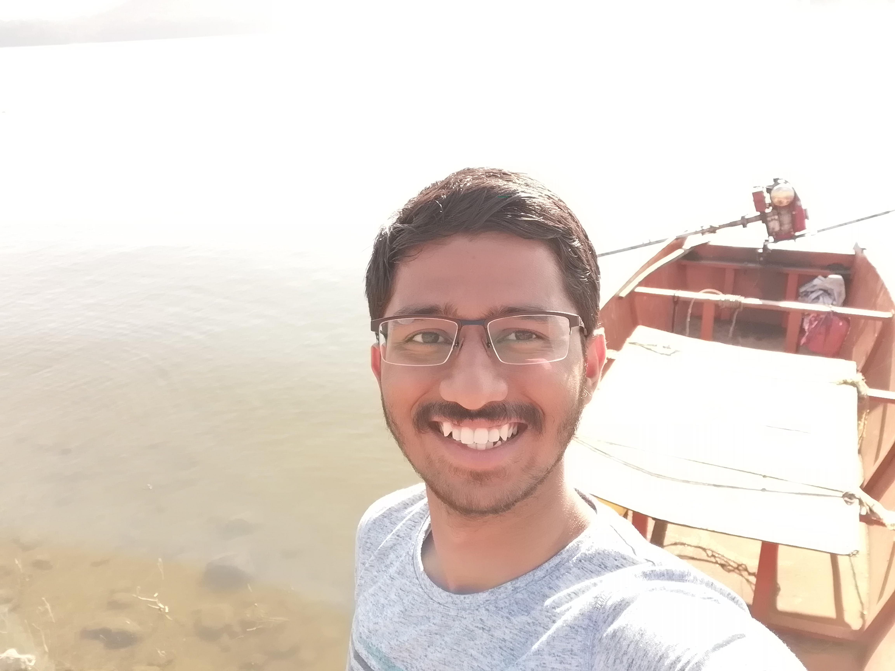

<!DOCTYPE html>
<html>
    <head>
        <title>
            About Me
        </title>
    </head>

    <body style=   "background-image: url(clouds.jpg); 
                    background-repeat: no-repeat;
                    background-attachment: fixed;
                    background-size: cover;">

        <h1 style = "text-align: center; color: skyblue; font-size: 300%;">Atharva Warhade</h1>

        
           <!--horizontal rule-->

        <!--My image-->
        

        
        

        <!--My introduction-->
        

        

            <h3>Hey!</h3>
            

                I am Atharva Warhade. I am pursueing my major in <b>Electrical Engineering</b> while studying at the <b>Indian Institute of Technology, Bombay</b>;. 
                I am a 1st year <b>B Tech</b> student enrolled in the year 2019. If you wnat to find me in the institute, you can try visiting <b>H16 A</b>, room <b>315</b> 
                (trust me, that's the only definite place you can find me at).
            

        

        

        <!--My hobbies-->
        

        

            <h2>My Hobbies</h2>
        

        

            I don't have hobbies that I actually try to pursue, but there do exist things that I find interesting. Some of them might include:
            <ul>
                <li>Swimming</li>
                <li>Running</li>
                <li>Cycling</li>
                <li>Reading</li>
                <li>Meditation</li>
            </ul>
        

        

        

        <!--My ambitions-->
        

        

            <h2>My Ambitions</h2>
        

        

            My dream is to become a <b>Paleontologist</b>. Now, I know what you might be thinking; that <i>Paleontology</i> is <b>not</b> an engineering field. But trust me, I have it all figured out!
            (or so he says!). Becoming a Paleontologist was my dream since I was 7, and I just can't give up on it even today. 
            
            That's still far fetched though. Right now, I would like to complete my college education and then maybe get a <b>Master's degree</b> from somewhere outside. Then I would like to work full time
            at a job to earn some income, and when I think I had earned enough, I'll quit it to pursue Paleontology (See, all planned out!).
        

        

        

        
        <!--Final Information to reach me-->
        

        

            <h3 style="font-family:'Courier New', Courier, monospace">
                Connect with me
            </h3>
        

        

            Drop a message
            <form>
                <input type="text" placeholder="Write your message here">
                <button><code style="color:blueviolet">Submit</code></button> 
            </form>  

            Or you can also connect with me using the following 
            With e-mail : <a href = "mailto: atharvawarhade12345@gmail.com">atharvawarhade12345@gmail.com</a>  
            With contact : +91-7378373242
        

        
"
    </body>
</html>
